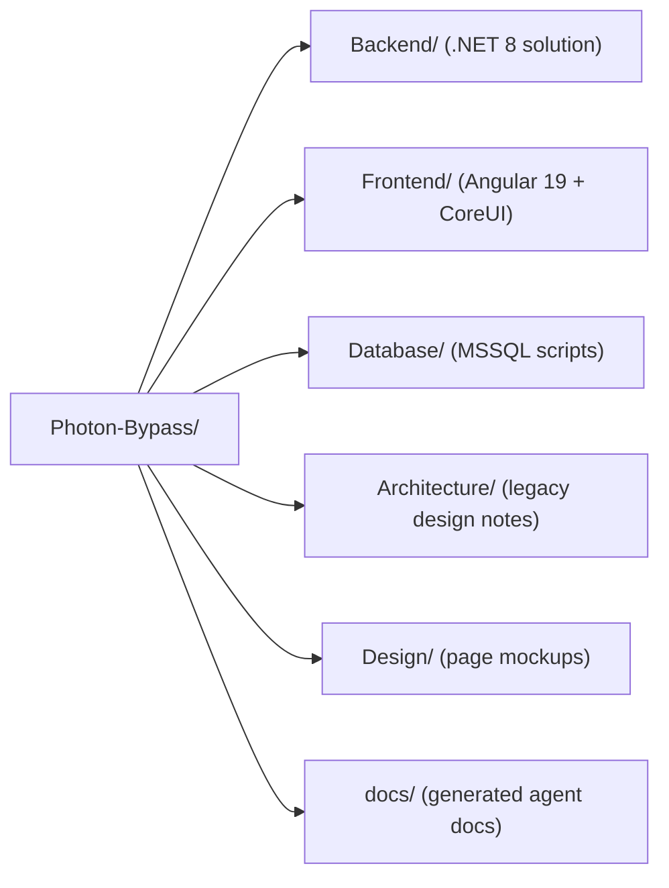
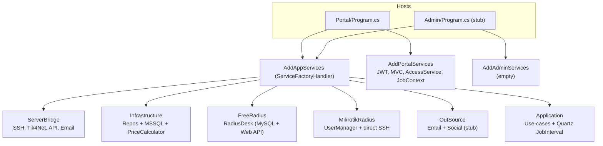

# AGENTS.md — Photon-Bypass

> **Who this is for**: AI coding agents (and humans) who need to change this codebase safely.
> Read this file first; it is the single entry point. Then follow the links in [Index](#index) for depth.
>
> **برای چه**: agent‌های ویرایش کد و درک کسب‌وکار. این فایل را ابتدا بخوانید و سپس لینک‌های فهرست را پیگیری کنید.

---

## What is this

**Photon-Bypass** is a self-hosted platform for selling and managing VPN accounts. It exposes two websites from one backend:

- a public **Home** page (advertisement / plan listing), and
- a **Profile** area where end-users view usage, renew plans, edit their account, and download VPN config.

External resources the backend talks to: the **local MSSQL database**, the **Radius server** (RadiusDesk = FreeRADIUS/MySQL + Web API, and/or **Mikrotik UserManager** via tik4net + SSH), the **Mikrotik routers** (direct SSH), an **email server**, and **WhatsApp** (social notifications). Background jobs (Quartz) periodically sync traffic, send warnings, deactivate stale accounts, and check server capacity.

**این چیست**: پلتفرم فروش و مدیریت اکانت VPN با دو سایت (صفحه تبلیغاتی + پروفایل کاربر). منابع خارجی: دیتابیس محلی، سرور Radius (RadiusDesk و/یا Mikrotik UserManager)، روترهای Mikrotik، ایمیل، واتساپ. کارهای پس‌زمینه همگام‌سازی ترافیک/هشدار/غیرفعال‌سازی را انجام می‌دهند.

---

## Repo map



| Path | Role |
|---|---|
| `Backend/Photon-Bypass.sln` | .NET 8 solution, the application core |
| `Frontend/` | Angular SPA (CoreUI 5 + Angular Material + Chart.js) |
| `Database/LocalDatabase/` | MSSQL schema + seed + key view (`TotalPlanState.sql`) |
| `Architecture/` | Original Persian design docs (`structure.md`, `analyse.md`, `TODO.md`) |
| `Design/` | Page mockup images |
| `docs/` | **This documentation set** (generated, agent-focused) |

> Note: `Backend/Administration/` exists on disk but is **not** part of the solution (orphan folder, empty controllers). `Backend/Tik4net/` holds the vendored `tik4net` library (solution folder `Tik4net`), not `ThirdParty/`.

---

## Stack

**Backend** (.NET 8): ASP.NET Core minimal hosting, Dapper (`Dapper.FastCrud` + `Z.Dapper.Plus` bulk), Serilog, Quartz.NET, JWT (`System.IdentityModel.Tokens.Jwt` + `JwtBearer`), Roslyn (`Microsoft.CodeAnalysis.CSharp`) for dynamic pricing, `tik4net` (Mikrotik API), `Renci.SshNet` (SSH), `MySql.Data` (Radius MySQL), `Microsoft.Data.SqlClient` (local MSSQL), `SkiaSharp` (image/cert handling).

**Frontend**: Angular 19 (standalone components), CoreUI 5 layout, Angular Material, Chart.js (`@coreui/angular-chartjs`), `lodash-es`.

**تکنولوژی**: بک‌اند .NET 8 با Dapper/Serilog/Quartz/JWT/Roslyn/tik4net/SSH.Net. فرانت Angular 19 + CoreUI 5 + Angular Material + Chart.js.

---

## Build & run

**Backend**

```bash
dotnet build Backend/Photon-Bypass.sln
dotnet run --project Backend/Portal          # dev host, HTTP proxy target is :5226
```

The Portal dev port is `5226` (matches `Frontend/proxy.conf.json`). The `Admin` host is an identical skeleton (`Admin/Program.cs`) that reuses Portal services plus an empty `AddAdminServices`.

**Frontend**

```bash
cd Frontend
yarn install      # or npm install
yarn start        # ng serve, dev server with proxy to :5226
yarn build        # production build
```

**Database** (MSSQL, database name `FastBypass` / scenario DB `FastBypass_DbScenario`): run `Database/LocalDatabase/Database.sql` first, then the remaining `.sql` files in that folder. Connection string lives in `Backend/Portal/appsettings.json` under `LocalDatabaseOptions:ConnectionString`.

**Test**

```bash
dotnet test Backend/Photon-Bypass.sln        # xUnit + Moq + FluentAssertions
cd Frontend && yarn test                      # Karma + Jasmine
```

> App secrets and the JWT signing key are committed in `Backend/Portal/appsettings.json` (`Issuer:Code`, connection strings). Do not copy values into docs or logs; reference by config key name only. See [docs/12-current-state.md](docs/12-current-state.md) for the security TODOs.

---

## Architecture in 60 seconds

Layered DDD. One composition root chains six registrations in strict order:

`Backend/ServiceFactoryHandler/ServiceFactoryHandler.cs:13` → `AddAppServices`:

```
AddServerBridgeServices → AddInfrastructureServices → AddRadiusDeskServices
  → AddMikrotikRadiusServices → AddOutSourceServices → AddApplicationServices
```

Each host then layers its own slice: `Portal` → `AddLogService().AddAppServices().AddPortalServices()`; `Admin` → `…​AddPortalServices().AddAdminServices()` (Admin currently just clones Portal).



Critical cross-cutting conventions:

- **`Lazy<T>` everywhere**: `Shared/Tools/LazyDependencyInjections.cs` registers both a service and a `Lazy<TService>` via `AddLazyScoped` / `AddLazyTransient` / `AddLazyKeyedTransient`. Most constructors inject `Lazy<IRepo>` to break dependency cycles.
- **Keyed DI for dual Radius**: the Radius backend is selected at runtime. `AccountRadiusSyncService` and `SessionRadiusSyncService` resolve `[FromKeyedServices(RadiusType.RadiusDesk)]` or `[FromKeyedServices(RadiusType.UserManager)]` of `IInfra*RadiusSyncService`, then dispatch on `server.Features & ServerFeature.Radius`. Never call a concrete Radius implementation directly.
- **Options validation on start**: `BindValidateReturn<TOptions>()` binds + validates (data annotations) + `ValidateOnStart`. Used for `LocalDapperOptions`, `EmailOptions`, `ManagementOptions`.
- **Multi-account (`target`)**: every authorized request flows a `target` (query or body). `ResultHandlerController.LoadJobContext(target)` checks access through `IAccessService` (an `IMemoryCache` set keyed `TargetArea|{username}` at login). Read account context from `IJobContext.Target`, not the raw query param.

**معماری در ۶۰ ثانیه**: لایه‌بندی DDD با یک ریشه DI (`ServiceFactoryHandler.cs:13`). دو سرور Radius به‌صورت keyed DI انتخاب می‌شوند. همه‌جا `Lazy<T>` تزریق می‌شود و گزینه‌ها روی start اعتبارسنجی می‌شوند. چنداکانت با پارامتر `target` و کش `IAccessService` مدیریت می‌شود.

---

## Conventions for safe edits

| If you want to… | Do this |
|---|---|
| Register a new service | Add it to the matching project's `ServiceFactory.cs`. Use `AddLazy*` from `Shared/Tools/LazyDependencyInjections.cs`. |
| Add a Repository | Implement `IEditableRepository<T>` on `DapperRepository<T>` base; register `AddLazyTransient<IRepo, Repo>()` in `Infrastructure/ServiceFactory.cs`. Map entity with `[Table]`/`[Key]`. |
| Add an API endpoint | Inherit `ResultHandlerController`, call `LoadJobContext(target?)`, return `ApiResult`/`ApiResult<T>`. Use `SafeApiResult(...)` to normalize. |
| Throw a user-facing error | `throw new UserException(message, detail, httpCode)` — the message is shown to the user; `detail` is dev-only. |
| Add a background task | Hook into `Application/Management/JobInterval.cs` (Quartz, 60-min) or register a new Quartz job. |
| Talk to Radius | Go through `IAccountRadiusSyncService` / `ISessionRadiusSyncService` (Infrastructure dispatchers). Never instantiate `RadDbContext` or `tik4net` directly in Application code. |
| Change pricing | Code lives in the DB (`PriceEntity.CalculatorCode`) and is Roslyn-compiled into a `Calculator.Compute(users, days, gigabytes)` method. See [docs/05-infrastructure.md](docs/05-infrastructure.md). |
| Run scripts on a NAS | Use `IProcessService` with a `ProcessContext` (shared variable bag). Variables are injected via `{key}` and validated against `^[ \-\.\w\d]+$`. See [docs/07-server-bridge.md](docs/07-server-bridge.md). |

---

## Index

Full reading order and per-file purpose is in [docs/00-index.md](docs/00-index.md). Quick map:

- [docs/01-overview.md](docs/01-overview.md) — product overview, external resources, phases
- [docs/02-architecture.md](docs/02-architecture.md) — projects, dependencies, DI composition
- [docs/03-domain.md](docs/03-domain.md) — entities, enums, business rules
- [docs/04-application.md](docs/04-application.md) — application services and `JobInterval`
- [docs/05-infrastructure.md](docs/05-infrastructure.md) — repositories, Dapper, Roslyn pricing
- [docs/06-radius-integration.md](docs/06-radius-integration.md) — dual-Radius dispatch
- [docs/07-server-bridge.md](docs/07-server-bridge.md) — SSH/Process/Script engine
- [docs/08-portal-api.md](docs/08-portal-api.md) — REST API surface (all endpoints)
- [docs/09-database.md](docs/09-database.md) — MSSQL schema + `TotalPlanState` view + Radius DB
- [docs/10-frontend.md](docs/10-frontend.md) — Angular app summary
- [docs/11-business-flows.md](docs/11-business-flows.md) — end-to-end scenarios
- [docs/12-current-state.md](docs/12-current-state.md) — implemented vs stub, starting points

---

## Known gaps / starting points

The platform is functional for the customer-facing flow (auth, account, plan renewal + billing, dual-Radius sync, background jobs, email notifications, dynamic pricing, main frontend pages). Incomplete areas:

- **`Backend/Admin`** — only `Program.cs` + empty `AddAdminServices`; no admin controllers. The server/profile/user management panel is not built.
- **`OutSource/SocialMediaService`** — all five methods return `Task.CompletedTask` (`// TODO`).
- **`SetOVpnCertificate`** (`MikrotikRadius/Application/MikrotikDirectService.cs:165`) — throws `NotImplementedException`.
- **WhatsApp** — compile-time gated behind `#if SOCIAL` (`AuthApplication.cs:104`, `AccountMonitoringService.cs:144`).
- **Google Auth** — listed as phase 5 in `README.md`.

See [docs/12-current-state.md](docs/12-current-state.md) for the full list and where to start for each, and `Architecture/TODO.md` for the original backlog.
