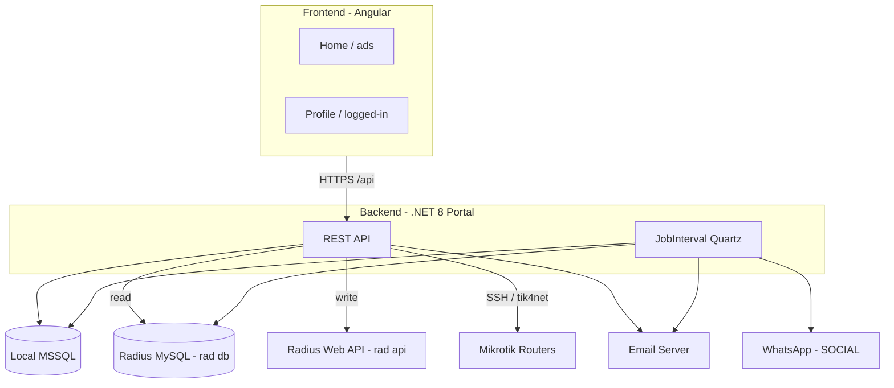

# docs/01-overview.md — Product overview

> **English summary**: Photon-Bypass sells and manages VPN accounts from one backend that serves two sites — a public Home (ads/plans) and a logged-in Profile. Three actor types (customer, manager-with-subusers, system/background) interact with five external resources: local MSSQL DB, Radius server (read via rad-db, write via rad-api), Mikrotik routers over SSH, WhatsApp, and an email server. Phasing comes from `README.md`.

## Two websites (دو وب‌سایت)

از یک بک‌اند مشترک، دو سایت سرو می‌شود:

1. **Home (تبلیغاتی / عمومی)** — صفحه‌ی فرود با شعار، لیست پلن‌ها و قیمت‌ها و مزیت‌های سرویس. کاربر بدون لاگین آن را می‌بیند. مسیر فرانت: `' '` (`Frontend/src/app/app.routes.ts:14`).
2. **Profile (پروفایل کاربر)** — منطقه‌ی لاگین‌شده با داشبورد مصرف، تاریخچه، ویرایش اطلاعات، تغییر پسورد (اکانت و OpenVpn)، تمدید و پرداخت. زیر `DefaultLayoutComponent` (`app.routes.ts:32`).

## Three actor types (سه نقش)

- **Customer (مشتری)**: ثبت‌نام، مشاهده‌ی وضعیت/مصرف، دریافت کانفیگ، تمدید، افزایش موجودی.
- **Manager (مدیر با زیرمجموعه)**: همان مشتری است اما `UserTypes` پرچم‌دار است و می‌تواند روی `target` (زیرمجموعه) عمل کند. منطق دسترسی در `IAccessService` و `LoadJobContext` (`docs/08`).
- **System / Background (سیستم)**: کارهای دوره‌ای Quartz (`JobInterval`) مثل pull ترافیک، هشدار پایان، غیرفعال‌سازی اکانت‌های رهاشده و بررسی ظرفیت سرور (`docs/04`).

> نکته‌ی مهم: پسورد لاگین اکانت در وب‌سایت با پسورد اتصال به سرورها (OpenVpn/Radius) متفاوت است؛ در ابتدا یکی هستند ولی از دو مسیر جدا تغییر می‌کنند (تغییر اکانت در `local db`، تغییر OpenVpn در `rad api`). (`README.md:117,201`)

## Five external resources (پنج منبع خارجی)

طبق `Architecture/analyse.md:303`:

| Resource | Purpose | Access mode |
|---|---|---|
| **Local DB** (`local db`) | اکانت، کیف پول، تاریخچه، تمدید، پلن، سرورها، قیمت | مستقیم MSSQL (`LocalDbContext`) |
| **Radius server** | وضعیت/اتصال کاربران VPN | **rad-db** (read، MySQL) و **rad-api** (write، Web API) — دو حالت RadiusDesk یا Mikrotik UserManager (`docs/06`) |
| **Mikrotik routers** (`mikrotik ssh`) | بستن کانکشن، ساخت گواهی، اسکریپت | SSH مستقیم (`ServerBridge/Ssh`) و tik4net (`docs/07`) |
| **WhatsApp** (`whatsapp api`) | هشدار ثبت‌نام/اعتبارسنجی/پایان سرویس | gated پشت `#if SOCIAL` (`docs/12`) |
| **Email server** | فراموشی پسورد، گواهی، هشدار پایان | SmtpClient (`EmailHandler`) |

قاعده‌ی مهم Radius: **خواندن از دیتابیس ردیوس (rad-db)** و **نوشتن از طریق API (rad-api)** انجام می‌شود تا بار روی ردیوس کمتر شود (`analyse.md:308`).

## Phases (فازبندی)

از `README.md:278`:

1. **Web Site Core** — هسته‌ی وب (Unit Test، Cloudflare Human Test، پنل چنداکانت، FAQ).
2. **MySql Performance** — بهینه‌سازی MySQL.
3. **Fake Website** — نماد، ساماندهی، درگاه پرداخت جعلی.
4. **Send WhatsApp Notif** — دکمه‌ی feedback و نوتیفیکیشن واتساپ.
5. **Google Auth** — ورود با گوگل.
6. **Other features**.

وضعیت جاری هر فاز در `docs/12-current-state.md` نگاشت شده است.

## Key constraints & notes (محدودیت‌ها و نکات کلیدی)

- **API rate limit** در یک بازه‌ی زمانی (`analyse.md:5`) — فعلاً پیاده‌سازی صریح دیده نمی‌شود؛ نقطه‌ی شروع در TODO.
- **Cache اطلاعات کاربر در فرانت** (`analyse.md:6`) — `UserService` اکانت را در حافظه و `target` را در `localStorage` نگه می‌دارد (`docs/10`).
- **محدودیت ارسال ایمیل** در یک بازه‌ی زمانی (`analyse.md:7`)؛ هشدارها با `DelayBetweenWarnings` (۲۰ ساعت) throttle می‌شوند (`docs/03`).
- **گواهی open-vpn**: اگر وجود نداشته باشد باید ساخته شود (`analyse.md:8`)؛ `SetOVpnCertificate` هنوز `NotImplementedException` می‌اندازد (`docs/12`).
- **اتصال یک کاربر به فقط یک سرور** و **محاسبه‌ی جای خالی** برای تمدید جدید (`README.md:49,260`) — از طریق `RestrictedRealmId` و ظرفیت realm.
