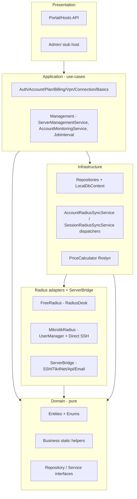
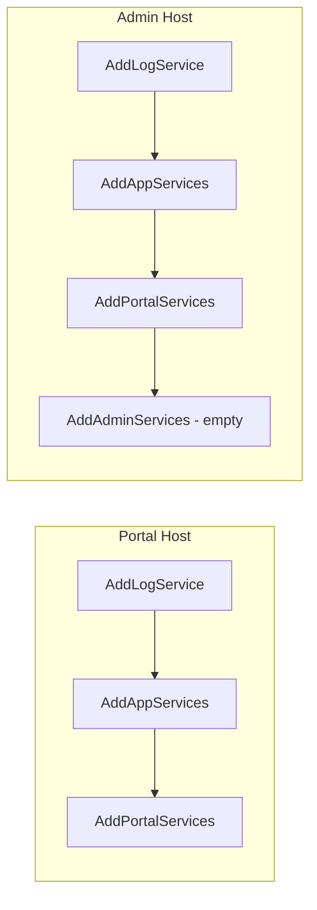
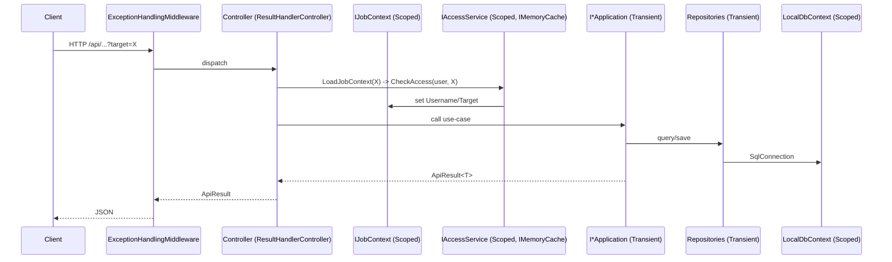

# docs/02-architecture.md — Architecture & layers

> **English summary**: Layered DDD over a single .NET 8 solution. The DI composition root (`ServiceFactoryHandler.AddAppServices`) chains six `ServiceFactory` registrations in a fixed order; each host (`Portal`/`Admin`) then layers JWT/MVC/Access on top. Dependencies flow inward (Domain has no outward refs); `Lazy<T>` and keyed DI break cycles and select the Radius backend at runtime.

## Layered DDD (لایه‌بندی)

بسط `Architecture/structure.md`:



قاعده‌ی اصلی: `Domain` به هیچ پروژه‌ی بیرونی وابسته نیست و شامل اینترفیس‌های پایدار (`IEditableRepository<T>`, `IAccountRepository`, `IAccountRadiusSyncService` …) است. سایر لایه‌ها به `Domain` وابسته‌اند.

## Solution projects (پروژه‌های سولوشن)

از `Backend/Photon-Bypass.sln` (۱۲ پروژه‌ی C# + پوشه‌ی سولوشن `Tik4net`):

| Project | Layer | Role |
|---|---|---|
| `Portal` | Presentation | میزبان اصلی API؛ `Program.cs` + کنترلرها + `AddPortalServices` (JWT/MVC/Access). |
| `Admin` | Presentation | میزبان دوم؛ فعلاً اسکلت `Program.cs` + `AddAdminServices` خالی. کنترلر ندارد. |
| `Application` | Application | سرویس‌های کاربردی + Quartz `JobInterval`. |
| `Domain` | Domain | Entity/Enum/Business + اینترفیس‌ها. وابسته به هیچ پروژه‌ی بیرونی. |
| `Infrastructure` | Infrastructure | Repositoryها، `LocalDbContext`، dispatchers ردیوس، `PriceCalculator`. |
| `FreeRadius` | Adapter | RadiusDesk: MySQL `RadDbContext` + repoها + Web API `RadiusDeskService`. |
| `MikrotikRadius` | Adapter | Mikrotik UserManager (tik4net) + SSH مستقیم NAS (`MikrotikDirectService`). |
| `ServerBridge` | Adapter | `SshHandler`/`Tik4NetHandler`/`ApiHandler`/`EmailHandler` + `ProcessService`. |
| `OutSource` | Adapter | `EmailService` + `SocialMediaService` (همگی stub). |
| `ServiceFactoryHandler` | Composition | `AddAppServices` — زنجیره‌ی ثبت شش‌گانه. |
| `Shared` | Cross | `ApiResult`، `UserException`، `AddLazy*`، `BindValidateReturn`. |
| `Tests` | Test | xUnit + Moq + FluentAssertions؛ `ServiceInitializer`. |
| `Tik4net/*` | Vendored | کتابخانه‌ی tik4net (در پوشه‌ی سولوشن، نه `ThirdParty/`). |

> توجه: `Backend/Administration/` روی دیسک هست اما **در سولوشن نیست** و کنترلر خالی دارد — پوشه‌ی یتیم.

## Dependency rules (قواعد وابستگی)

- `Domain` ← هیچ‌چیز (فقط اینترفیس و مدل‌ها).
- `Application` → `Domain`.
- `Infrastructure` → `Domain` (+ `Dapper.FastCrud`, `Z.Dapper.Plus`, `Microsoft.Data.SqlClient`, `Microsoft.CodeAnalysis.CSharp`).
- `FreeRadius` / `MikrotikRadius` → `Infrastructure` (برای `IInfra*RadiusSyncService`) و `ServerBridge` و `Domain`.
- `ServerBridge` → `Domain` (+ `Renci.SshNet`).
- `Portal`/`Admin` → `Application` (+ `Shared` برای لایه‌ی host).

## DI composition root (ریشه‌ی DI)

نقطه‌ی ورود تکی در `Backend/ServiceFactoryHandler/ServiceFactoryHandler.cs:13`:

```
AddServerBridgeServices()        // ServerBridge/ServiceFactory.cs   - SSH/Tik4Net singleton, Api/Email scoped
  → AddInfrastructureServices() // Infrastructure/ServiceFactory.cs - repos, LocalDbContext, dispatchers, PriceCalculator
  → AddRadiusDeskServices()     // FreeRadius/ServiceFactory.cs      - RadDbContext, keyed(RadiusDesk) services
  → AddMikrotikRadiusServices() // MikrotikRadius/ServiceFactory.cs  - keyed(UserManager) services, MikrotikDirectService
  → AddOutSourceServices()      // OutSource/ServiceFactory.cs       - EmailOptions validated, Email + Social scoped
  → AddApplicationServices()    // Application/ServiceFactory.cs     - use-cases, ManagementOptions, Quartz JobInterval
```

سپس هر host لایه‌ی خود را اضافه می‌کند:



`AddPortalServices` (`Backend/Portal/ServiceFactory.cs:12`) سرویس‌های فریم‌ورک (`AddControllers`، JWT Bearer با کلید `Issuer:Code`، Authorization، `MemoryCache`) و `IAccessService`/`IJobContext` (هر دو Scoped و Lazy) را ثبت می‌کند.

`AddAdminServices` (`Backend/Admin/ServiceFactory.cs:5`) فعلاً خالی است — Admin در عمل کلون Portal است.

## Cross-cutting DI patterns (الگوهای DI سراسری)

### `Lazy<T>` everywhere

`Shared/Tools/LazyDependencyInjections.cs` این متدها را فراهم می‌کند:

- `AddLazyScoped<TService, TImpl>()` / `AddLazyScoped<TService>(factory)`
- `AddLazyTransient<TService, TImpl>()` / `AddLazyTransient<TService>(factory)`
- `AddLazyKeyedTransient<TService, TImpl>(key)`

هر کدام هم سرویس اصلی و هم `Lazy<TService>` را ثبت می‌کنند. اکثر سازنده‌ها `Lazy<IRepo>` تزریق می‌کنند تا چرخه‌ی وابستگی (مثلاً بین Application و Repositoryها) شکسته شود.

### Options validation on start

`BindValidateReturn<TOptions>()` (`LazyDependencyInjections.cs:48`) به‌صورت `BindConfiguration(typeof(TOptions).Name)` بایند می‌کند، `ValidateDataAnnotations()` و `ValidateOnStart()` را فعال می‌کند. برای `LocalDapperOptions`، `EmailOptions` و `ManagementOptions` استفاده شده است؛ یعنی اگر کلید پیکربندی غایب/نامعتبر باشد، host روی start کرش می‌کند.

### Keyed DI for dual Radius

دو پیاده‌سازی ردیوس همزمان با کلیدهای ثابت `"RadiusDesk"` و `"UserManager"` (`Infrastructure/Radius/RadiusType.cs`) ثبت می‌شوند و سرویس‌های dispatch در `Infrastructure` با `[FromKeyedServices(...)]` آن‌ها را بر اساس پرچم `ServerFeature` انتخاب می‌کنند. جزئیات در `docs/06-radius-integration.md`.

## Request → DI flow (جریان یک درخواست)


