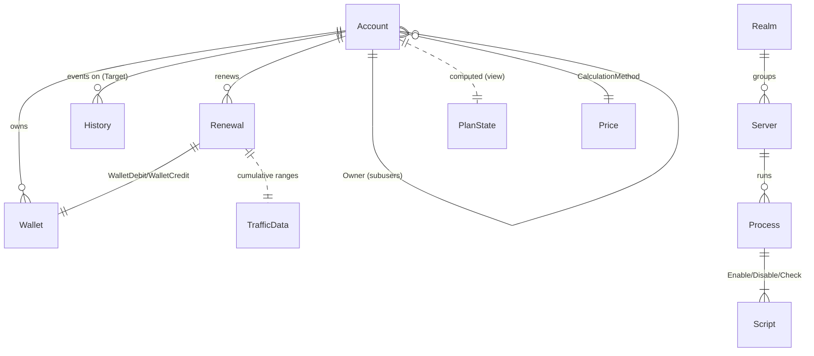

# docs/03-domain.md — Domain model & rules

> **English summary**: The `Domain` project holds entities (mapped to MSSQL tables), enums (mostly `[Flags]`), pure-static business helpers (`AccountBusiness`, `RenewalBusiness`, `PlanStateBusiness`, `WalletBusiness`), and stable repository/service interfaces. It references nothing outward. This file is the reference for entity↔table, enum values, and the exact business rules (traffic multiples of 25, time multiples of 30, deactivation thresholds 7/40 days).

## Entities (نهادها)

رابط پایه: `IBaseEntity` (`Backend/Domain/IBaseEntity.cs`). همه‌ی entityها با `[Table]`/`[Key]` نگاشت می‌شوند.

| Entity file | DB table | Group | Notes |
|---|---|---|---|
| `Domain/Account/Entity/AccountEntity.cs` | `Account` | Account | یوزرنیم یکتا، پسورد هش‌شده، `VpnPassword` جداگانه، `Owner` (FK خود-ارجاع برای زیرمجموعه). |
| `Domain/Account/Entity/WalletEntity.cs` | `Wallet` | Account | کیف پول؛ `Direction` (Credit/Debit)، `Status`، `InvoiceCode`، `Action` (رشته‌ی تمدید تعویق‌یافته). |
| `Domain/Account/Entity/HistoryEntity.cs` | `History` | Account | لاگ رویدادها روی یک target. |
| `Domain/Account/Entity/ResetPassEntity.cs` | `ResetPassword` | Account | توکن فراموشی پسورد. |
| `Domain/Plan/Entity/RenewalEntity.cs` | `Renewal` | Plan | یک تمدید؛ `IRenewalEntity` را پیاده می‌کند. |
| `Domain/Plan/Entity/PlanStateEntity.cs` | `PlanState` | Plan | **view-based** (از `TotalPlanState` خوانده می‌شود)؛ خواص محاسباتی دارد. |
| `Domain/Plan/Entity/TrafficDataEntity.cs` | `TrafficData` | Plan | رکورد ترافیک دوره‌ای از radius. |
| `Domain/Plan/Entity/IRenewalEntity.cs` | — | Plan | رابط مشترک `Renewal` و `PlanState`. |
| `Domain/Servers/Entity/ServerEntity.cs` | `Server` | Servers | سرور/روتر؛ `Features` (Flags)، `OsType`، `RealmId`. |
| `Domain/Servers/Entity/RealmEntity.cs` | `Realm` | Servers | گروه سرورها با `BandWidth` و آخرین sync. |
| `Domain/Servers/Entity/ProcessEntity.cs` | `Process` | Servers | مجموعه‌ای از اسکریپت‌ها (`Enable`/`Disable`/`Check`). |
| `Domain/Servers/Entity/ScrtipEntity.cs` | `Script` | Servers | یک اسکریپت با `Content` و `OutputPattern` (نام فایل در سورس با غلط املایی `Scrtip` ثبت شده). |
| `Domain/Static/PriceEntity.cs` | `Price` | Static | کد قیمت‌گذاری (`CalculatorCode`) که با Roslyn کامپایل می‌شود + `PriceStates`. |

### PlanStateEntity computed properties

`PlanStateEntity` (`Backend/Domain/Plan/Entity/PlanStateEntity.cs:7`) چندین ویژگی `[NotMapped]` دارد:

- `TimeLeft` => `ExpirationDate - DateTime.Now` (یک `TimeSpan?`).
- `TrafficLeftPercent` => `100 * TrafficLeft / TrafficLimit`.
- `TimeLeftPercent` => نسبت زمان باقی‌مانده به کل.
- `LastConnectionWasSuccessful` / `LastConnectionMessage` (پر می‌شوند هنگام بررسی اتصال).

## Enums

| Enum | File | Kind | Values |
|---|---|---|---|
| `UserTypes` | `Domain/Account/Model/UserTypes.cs` | `[Flags] byte` | `None=0`, `OldUser=1`, `AllowMonthly=2` |
| `BalanceDirection` | `Domain/Account/Model/BalanceDirection.cs` | `short` | Credit / Debit |
| `BalanceStatus` | `Domain/Account/Model/BalanceStatus.cs` | `byte` | وضعیت تراکنش/فاکتور (مثل `Failed`, `Completed`) |
| `EventCategory` | `Domain/Account/Model/EventCategory.cs` | `byte` | دسته‌ی رویداد تاریخچه (مثل `Transaction`) |
| `EventType` | `Domain/Account/Model/EventType.cs` | `byte` | نوع رویداد (مثل `Information`) |
| `ServerFeature` | `Domain/Servers/Types/ServerFeature.cs` | `[Flags]` | `Radius=0xFF` (`RadiusDesk=0x1`, `UserManager=0x2`)؛ `Nas=0xFF00` (`Ikev2=0x100`, `Sstp=0x200`, `Ovpn=0x400`, `V2ray=0x800`) |
| `OperatingSystem` | `Domain/Servers/Types/OperatingSystem.cs` | `byte` | نوع OS سرور (مثلاً `Mikrotik`) |
| `ScriptType` | `Domain/Servers/Types/ScriptType.cs` | `byte` | `Disable=0`, `Enable=1`, `Check=2` |
| `ConnectionState` | `Domain/Plan/Model/UserConnectionBinding.cs` | — | وضعیت اتصال کاربر |
| `PriceStates` | `Domain/Static/PriceEntity.cs` | — | وضعیت آیتم قیمت |

> نکته‌ی کلیدی: انتخاب سرور Radius با `radius.Features & ServerFeature.Radius` و سپس تطبیق با `ServerFeature.UserManager` / `ServerFeature.RadiusDesk` انجام می‌شود (`docs/06`).

## Business rules (قواعد کسب‌وکار)

کلاس‌های static خالص در `Domain/*/Business/`:

### `AccountBusiness` (`Domain/Account/Business/AccountBusiness.cs`)

- `MaxDaysDeactivatePlanToDisable = 7` — پس از ۷ روز غیرفعالی، اکانت در ردیوس disable می‌شود.
- `MaxDaysDeactivatePlanToDelete = 40` — پس از ۴۰ روز از ردیوس حذف می‌شود.
- `DelayBetweenWarnings = 20` — حداقل ۲۰ ساعت بین دو هشدار پایان سرویس.
- `OverWarningTime(account)` — آیا هنوز در پنجره‌ی throttle است؟
- الگوهای اعتبارسنجی (regex مولد):
  - `UsernamePattern`: `^[a-zA-Z][a-zA-Z0-9_-]{3,16}[a-zA-Z0-9]$`
  - `EmailPattern`: `^[\w-\.]+@([\w-]+\.)+[\w-]{2,4}$`
  - `MobileNumberPattern`: `^(\+\d{2}|0)\d{10}$`
- `IsReachedMaxInactivityDaysToDisable/Delete` — روزهای گذشته از آستانه را برمی‌گرداند (۰ = هنوز نرسیده).
- موبایل با پیشوند `0` به‌صورت خودکار به `+98` نرمالایز می‌شود.

### `RenewalBusiness` (`Domain/Plan/Business/RenewalBusiness.cs`)

قواعد اعتبارسنجی تمدید (`RenewalValidation`):

- ترافیک باید **ضریب ۲۵ گیگ** باشد (`TrafficLimit / BytesInGig % 25 == 0`).
- اگر کاربر `AllowMonthly` نباشد، ترافیک الزامی است.
- زمان (اگر دستی داده شود) باید **ضریب ۳۰ روز** باشد.
- **زمان از ترافیک مشتق می‌شود** (اگر ترافیک داده شد):
  - `gigabyte_packages = TrafficLimit / 1GB / 25`
  - `traffic_bonus = 60 + gigabyte_packages * 30`
  - `user_fine = 5 * UserFine(SimultaneousUser)`
  - `TimeLimitInDays = traffic_bonus - user_fine`
- فرمول `UserFine(users)`:
  - `users <= 1` => `0`
  - `users >= 5` => `users + 3`
  - در غیر این صورت => `4.5 * users - 3 - users² / 2`

### `PlanStateBusiness` (`Domain/Plan/Business/PlanStateBusiness.cs`)

- `IsFinishing` — درست وقتی `TimeLeftPercent` یا `TrafficLeftPercent` کمتر از **۱۰٪** (`0.1f`) باشد.
- `GetRemainsTitle` — متن فارسی «n گیگ و m روز باقی‌مانده».
- `GetTrafficLimitInGig` / `GetTrafficUsedInGig` / `GetTrafficLeftInGig` — تبدیل بایت به گیگابایت.

### `WalletBusiness` (`Domain/Account/Business/WalletBusiness.cs`)

کمکی‌های کیف پول (موجودی، نیاز به پول برای تمدید). منطق «آیا موجودی کافی است» از طریق `AccountEntity.CheckMoneyNeed(balance, estimate, out money_need)` در جریان تمدید استفاده می‌شود (`docs/11`).

## Repository & service interfaces (اینترفیس‌ها)

پایه‌ی دسترسی داده در `Domain/Repository` و لایه‌های دیگر:

- **Repository base**: `IEditableRepository<T>` (دارای `Save`/`Delete`/`DbContext`/`Events`) روی `DapperRepository<T>` در Infrastructure (`docs/05`).
- **Domain repository interfaces** (`Domain/*/`):
  - Account: `IAccountRepository`, `IWalletRepository`, `IHistoryRepository`, `IResetPassRepository`
  - Plan: `IRenewalRepository`, `IPlanStateRepository`, `ITrafficDataRepository`
  - Servers: `IServerRepository`, `IRealmRepository`
  - Static: `IPriceRepository`
- **DB context**: `IDbContext` (`BeginTransactionAsync`/`CommitAsync`/`RollbackAsync`) و `IDapperDbContext`.
- **Entity events**: `IEntityEventService` و `IEntityEvent<T>` با رویدادهای `OnSave` / `OnDelete`.
- **Radius sync (dispatch interfaces در Domain)**: `IAccountRadiusSyncService`, `ISessionRadiusSyncService`.

## Cross-cutting (سرویس‌های سراسری دامنه)

- **`IJobContext`** (`Domain/IJobContext.cs`): `Username`، `Target`، `AccountId` به‌علاوه‌ی `InjectJobContext(...)` برای تنظیم زمینه‌ی درخواست/تراکنش. پیاده‌سازی Scoped در `Portal/Basical/JobContext.cs`.
- **`IAccessService`** (`Domain/Account/IAccessService.cs`): `CheckAccess(username, target)`، `LoginEvent(username, area)`، `LogoutEvent(username)`. چنداکانتی را با کش `TargetArea|{username}` مدیریت می‌کند (`docs/08`).

## ER sketch (نمودار ER نهادها)

> `PlanState` و `TotalPlanState` محاسباتی هستند و نه جدول ساده — منطق آن در `docs/09-database.md`.
