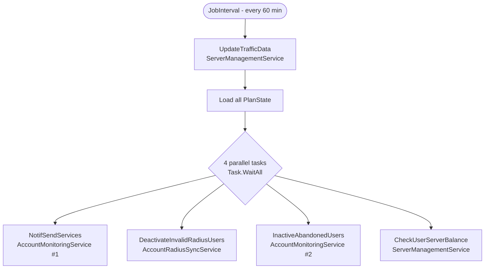
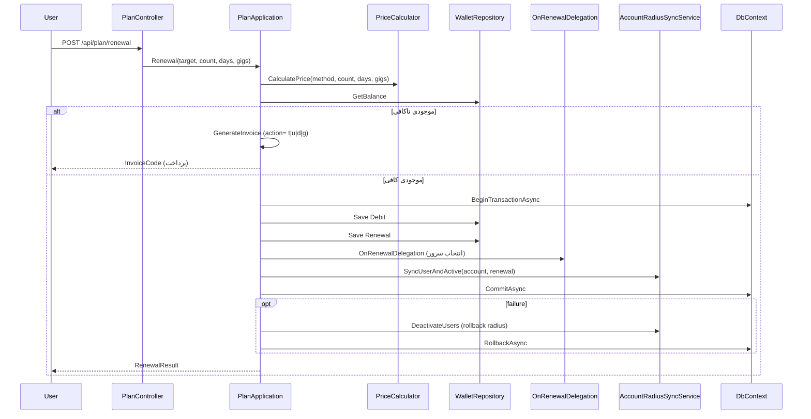

# docs/04-application.md — Application layer & use cases

> **English summary**: The `Application` project hosts use-case services (`Auth`, `Account`, `Plan`, `Billing`, `Connection`, `Vpn`, `Basics`) plus management services (`ServerManagementService`, `AccountMonitoringService`) and the Quartz `JobInterval` (60 min). All registered `AddLazyTransient` in `Application/ServiceFactory.cs:24`. Cross-account context flows through `IJobContext`; long flows use repository transactions; `IPlanApplication.OnRenewal/OnRenewalDelegation` are static hooks for multi-account delegation.

## Application services (سرویس‌های کاربردی)

ثبت در `Backend/Application/ServiceFactory.cs:24` (همگی `AddLazyTransient`):

| Interface | Implementation | Role | Key methods |
|---|---|---|---|
| `IAuthApplication` | `AuthApplication` | احراز هویت | `CheckUserPassword`, `ForgetPassword`, `ResetPassword`, `Register` |
| `IAccountApplication` | `AccountApplication` | مدیریت اکانت | `GetUser`, `GetFullInfo`, `EditUser`, `ChangePassword`, `GetHistory`, `GetActiveUser` |
| `IPlanApplication` | `PlanApplication` | وضعیت/تمدید پلن | `GetPlanState`, `GetPlanInfo`, `Estimate`, `Renewal` (چند overload) |
| `IBillingApplication` | `BillingApplication` | فاکتور و پرداخت | `GenerateInvoiceCode`, `GetInvoice`, `PaymentCallback` |
| `IConnectionApplication` | `ConnectionApplication` | اتصال‌های فعال | `GetCurrentConnectionState`, `CloseConnection` |
| `IVpnApplication` | `VpnApplication` | کانفیگ/گواهی/ترافیک | `ChangeVpnPassword`, `SendCertEmail`, `TrafficData` |
| `IBasicsApplication` | `BasicsApplication` | اطلاعات عمومی | `GetPrices` (بدون لاگین) |
| `IServerManagementService` | `ServerManagementService` | مدیریت پس‌زمینه | `UpdateTrafficData`, `CheckUserServerBalance` |
| `IAccountMonitoringService` | `AccountMonitoringService` | مانیتورینگ اکانت | `NotifSendServices`, `InactiveAbandonedUsers` |

سرویس‌های Radius (`IAccountRadiusSyncService`, `ISessionRadiusSyncService`) در `Infrastructure` پیاده شده‌اند (`docs/06`) ولی اینترفیسشان در `Domain` است و Application از همان اینترفیس استفاده می‌کند — هرگز پیاده‌سازی خاصی را مستقیم فراخوانی نکنید.

## Background job (کار پس‌زمینه)

`JobInterval` (`Backend/Application/Management/JobInterval.cs:11`) یک IJob کوارتز است که هر **۶۰ دقیقه** اجرا می‌شود (`IntervalInMinutes = 60`؛ trigger در `Application/ServiceFactory.cs:34`).



> نکته: هر شاخه parallel یک Scope جدید (`CreateScope`) می‌سازد تا سرویس‌های Scoped در یک Job Singleton درست resolve شوند.

چهار کار موازی:
1. **`NotifSendServices`** — هشدار پایان پلن (ایمیل/واتساپ) با throttle `DelayBetweenWarnings` (۲۰h).
2. **`DeactivateInvalidRadiusUsers`** — غیرفعال‌سازی کاربران ردیوس که دیگر پلن معتبر ندارند.
3. **`InactiveAbandonedUsers`** — غیرفعال‌سازی اکانت‌های رهاشده (پس از ۷ روز) و حذف از ردیوس (پس از ۴۰ روز).
4. **`CheckUserServerBalance`** — بررسی ظرفیت realmها و هشدار ادمین.

## Multi-account delegation (تکلیف چنداکانتی)

- هر درخواست از طریق `IJobContext.Username/Target/AccountId` زمینه‌ی «به‌نام چه کسی» را حمل می‌کند. کنترلر در `LoadJobContext(target)` آن را با `IAccessService` اعتبارسنجی می‌کند (`docs/08`).
- **`IPlanApplication.OnRenewal`** و **`IPlanApplication.OnRenewalDelegation`**: رویدادهای استاتیک که هنگام تمدید فراخوانی می‌شوند و به لایه‌های دیگر (مثلاً انتخاب سرور برای زیرمجموعه) اجازه‌ی مداخله می‌دهند. در `PlanApplication` تمدید، مقدار بازگشتی `OnRenewalDelegation` بررسی می‌شود و اگر ناموفق باشد تراکنش rollback می‌شود.
- **`IJobContext.InjectJobContext(accountId, username, target)`**: برای مسیرهای غیر-HTTP (مثل کال‌بک پرداخت) که زمینه به‌صورت دستی تزریق می‌شود (`PlanApplication.cs:165`).

## Transactions (تراکنش‌ها)

الگوی یکپارچه روی `*Repository.DbContext`:

```
await AccountRepo.Value.DbContext.BeginTransactionAsync();
try {
    // save wallet / renewal / history
    await AccountRadiusSrv.Value.SyncUserAndActive(account, renew);  // external call
    await AccountRepo.Value.DbContext.CommitAsync();
} catch {
    await AccountRadiusSrv.Value.DeactivateUsers([account.Username]); // rollback radius side
    await AccountRepo.Value.DbContext.RollbackAsync();
    throw;
}
```

مثال‌های واقعی:
- **تمدید**: `Backend/Application/Plan/PlanApplication.cs:265` (`BeginTransactionAsync`) → برش موجودی، ذخیره‌ی تمدید، فراخوانی `OnRenewalDelegation`، همگام‌سازی radius، commit.
- **فاکتور**: `Backend/Application/Billing/BillingApplication.cs:151` → ساخت/بستن فاکتور، ذخیره‌ی wallet + renewal، commit.
- **کال‌بک پرداخت**: `BillingApplication.cs:97` `PaymentCallback` — فاکتور را completed می‌کند سپس اکشن‌های تمدید تعویق‌یافته را با `PlanApp.Value.Renewal(accountId, walletId, action)` اجرا می‌کند.

> نکته‌ی مهم درباره‌ی rollback: چون فراخوانی radius یک عمل خارجی است، rollback صرفِ DB کافی نیست؛ به همین دلیل در `catch` یک `DeactivateUsers` برای برگرداندن وضعیت radius اجرا می‌شود.

## Renewal sequence (توالی تمدید)



نوع action تمدید تعویق‌یافته: رشته‌ی `{target}t|{count}u|{days}d|{gigabytes}g` که در کال‌بک پرداخت parse می‌شود (`BillingApplication.cs:122`، `PlanApplication.cs:135-149`).
