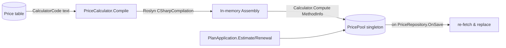
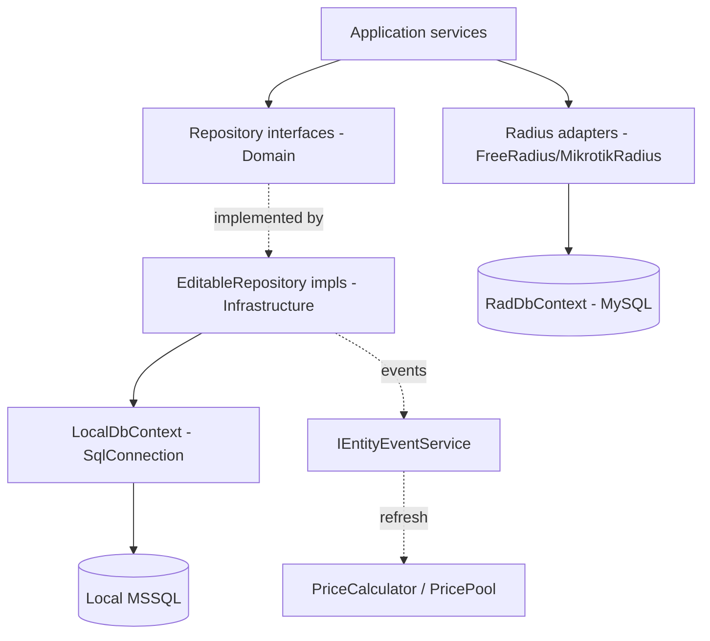

# docs/05-infrastructure.md — Data access & tools

> **English summary**: `Infrastructure` implements repositories on a Dapper base (`DapperRepository<T>` + `EditableRepository<T>`), wraps the local MSSQL in `LocalDbContext`, raises entity events (`OnSave`/`OnDelete`), and hosts the Roslyn `PriceCalculator` (compiles C# code stored in the DB). Repositories are registered `AddLazyTransient`; the DB context is Scoped and owns transactions.

## Repository base (پایه‌ی repository)

`Backend/Infrastructure/Database/`:

- `DapperRepository<TEntity>(IDapperDbContext)` — خواندن‌های پایه با Dapper.FastCrud.
- `EditableRepository<TEntity>` (`EditableRepository.cs:9`) — `Save`/`Save(IEnumerable)`/`Delete` را اضافه می‌کند و:
  - روی `Id > 0` عمل `Update` و در غیر این صورت `Insert` انجام می‌دهد.
  - برای مجموعه‌ها از **bulk** `Z.Dapper.Plus` (`BulkUpdateAsync`/`BulkInsertAsync`/`BulkDeleteAsync`) استفاده می‌کند.
  - هر نوشتن/حذف را به `IEntityEventService.CallOnSave/OnDelete` گوش می‌سپارد.
  - `DbContext` (از نوع `IDbContext`) را به‌عنوان ویژگی عمومی暴露 می‌کند تا Application بتواند تراکنش باز/commit/rollback کند.
  - اگر تراکنشی باز باشد، statementها با `AttachToTransaction` به آن متصل می‌شوند (`CheckTransaction`).

## Local DB (دیتابیس محلی)

- `LocalDbContext` (`Backend/Infrastructure/Repository/DbContext/LocalDbContext.cs:9`) — `IDapperDbContext` با `SqlConnection` (`Microsoft.Data.SqlClient`) و تراکنش صریح (`BeginTransactionAsync`/`CommitAsync`/`RollbackAsync`).
- Options: `LocalDapperOptions` (`ConnectionString`، `StructureFilesPath`، `DataFilesPath`)؛ با `BindValidateReturn` در start اعتبارسنجی می‌شود.
- به‌صورت Scoped ثبت شده (`Infrastructure/ServiceFactory.cs:22`)؛ هر repo این context را از طریق constructor تزریق می‌گیرد (نه به‌صورت singleton، تا تراکنش per-request بماند).

## Entity events (رویدادهای entity)

- `IEntityEventService` (Singleton) رجیستر/حذف/فراخوانی handlerها را مدیریت می‌کند.
- `IEntityEvent<T>` با دو رویداد `OnSave` و `OnDelete` از طریق `EditableRepository.Events` در دسترس است.
- مثال کاربردی: `PriceRepository.OnSave` باعث refresh خودکار کش `PricePool` در `PriceCalculator` می‌شود (`PriceCalculator.cs:24`).

## Transactions (تراکنش‌ها)

پیاده‌سازی `IDbContext` روی `LocalDbContext`:

- تنها یک تراکنش همزمان مجاز است (`"A transaction Already opened"`).
- `CommitAsync`/`RollbackAsync` پس از اجرا `currentTransaction` را null می‌کنند.

همین الگو روی `RadDbContext` (MySQL) نیز پیاده شده (`docs/06`).

## Price calculator (محاسبه‌گر قیمت پویا)

`PriceCalculator` (`Backend/Infrastructure/Services/PriceCalculator.cs:8`) — **کامپایل runtime کد C# که در دیتابیس ذخیره شده** با `Microsoft.CodeAnalysis.CSharp`:

1. کد از `PriceEntity.CalculatorCode` خوانده می‌شود (`IPriceRepository.GetActives`).
2. در یک `CSharpCompilation` کامپایل، در `MemoryStream` emit و با `Assembly.Load` بارگذاری می‌شود.
3. **قرارداد کد**: باید کلاسی به نام `Calculator` با متد static `Compute(users, days, gigabytes)` داشته باشد. اگر نبود، exception با پیام راهنما پرتاب می‌شود.
4. `MethodInfo` در `PricePool` (Singleton) کش می‌شود و با key قیمت invoke می‌شود (`method.Invoke(null, [users, days, gigabytes])`).
5. **به‌روزرسانی خودکار**: هنگام `InitializeCalculators`، `repository.Value.Events.OnSave` ثبت می‌شود تا هر ذخیره‌ی قیمت، کل pool را دوباره fetch کند.

> امنیت: کد قیمت از دیتابیس می‌آید و در پروسِس برنامه اجرا می‌شود — فقط ادمین باید بتواند ردیف `Price` را ویرایش کند.

## Implemented repositories (repoهای پیاده‌سازی‌شده)

در `Backend/Infrastructure/Repository/` (همگی `AddLazyTransient` در `Infrastructure/ServiceFactory.cs`):

| Repository | Entity | Thisترفیس |
|---|---|---|
| `AccountRepository.cs` | `Account` | `IAccountRepository` |
| `WalletRepository.cs` | `Wallet` | `IWalletRepository` |
| `HistoryRepository.cs` | `History` | `IHistoryRepository` |
| `ResetPassRepository.cs` | `ResetPassword` | `IResetPassRepository` |
| `RenewalRepository.cs` | `Renewal` | `IRenewalRepository` |
| `PlanStateRepository.cs` | `PlanState` (از view) | `IPlanStateRepository` |
| `TrafficDataRepository.cs` | `TrafficData` | `ITrafficDataRepository` |
| `ServerRepository.cs` | `Server` | `IServerRepository` |
| `RealmRepository.cs` | `Realm` | `IRealmRepository` |
| `PriceRepository.cs` | `Price` | `IPriceRepository` |

همچنین در همین پروژه:
- `AccountRadiusSyncService` و `SessionRadiusSyncService` (dispatchers ردیوس — `docs/06`).
- `PriceCalculator` + `PricePool`.
- `ServerEntityExtension.RunJob` (اجرای موازی روی لیست سرورها).

## Layering diagram (نمودار لایه‌بندی)

