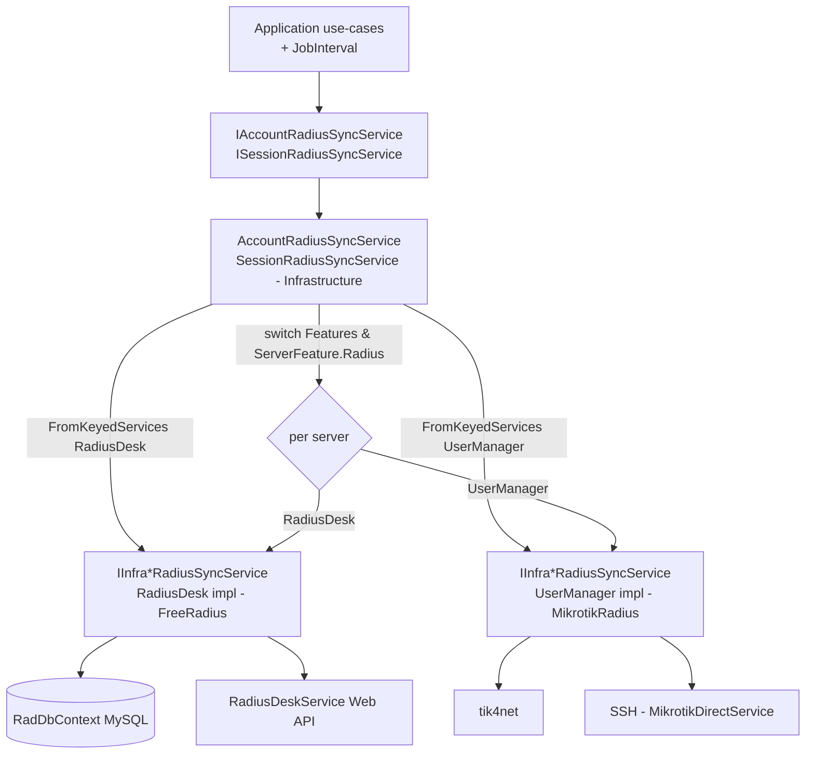
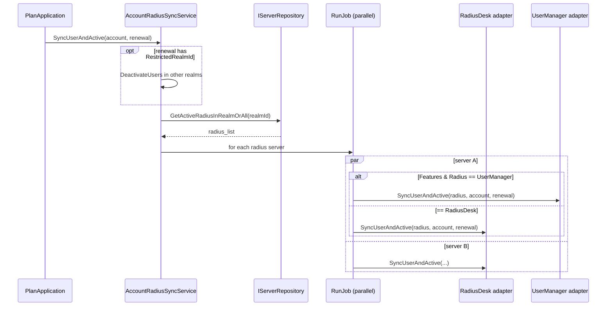

# docs/06-radius-integration.md — Dual-Radius sync

> **English summary**: The backend can talk to two Radius backends simultaneously — RadiusDesk (FreeRADIUS/MySQL + Web API) and Mikrotik UserManager (tik4net + SSH). The Infrastructure dispatchers (`AccountRadiusSyncService`, `SessionRadiusSyncService`) resolve the right adapter per server via keyed DI (`RadiusType.RadiusDesk` / `RadiusType.UserManager`) and a `switch` on `server.Features & ServerFeature.Radius`. Operations fan out in parallel over all active Radius servers in a realm using `RunJob`.

## The problem (مسئله)

طبق `Architecture/analyse.md:308`:
- **خواندن** وضعیت کاربر از **دیتابیس ردیوس (rad-db)** انجام می‌شود.
- **نوشتن** (ثبت/غیرفعال/بستن کانکشن/تغییر پسورد) از طریق **Web API ردیوس (rad-api)** انجام می‌شود.

و سیستم باید همزمان از دو پیاده‌سازی ردیوس پشتیبانی کند:
- **RadiusDesk** = FreeRADIUS با MySQL + REST API (cake4/rd_cake) — پروژه‌ی `FreeRadius`.
- **Mikrotik UserManager** = tik4net + SSH مستقیم — پروژه‌ی `MikrotikRadius`.

## Dispatch strategy (استراتژی dispatch)

دو لایه‌ی اینترفیس:

1. **لایه‌ی بالا (Domain، استفاده‌شده توسط Application)**: `IAccountRadiusSyncService` و `ISessionRadiusSyncService`.
2. **لایه‌ی پایین (Infrastructure-internal)**: `IInfraAccountRadiusSyncService` و `IInfraSessionRadiusSyncService` — با **keyed services** ثبت می‌شوند.

پیاده‌سازی‌های بالا (`AccountRadiusSyncService`, `SessionRadiusSyncService` در `Infrastructure/Services/`) هر دو adapter را به‌صورت `[FromKeyedServices(...)] Lazy<IInfra...>` تزریق می‌کنند و سپس برای هر سرور، بر اساس پرچم مسیریابی می‌کنند:

```csharp
switch (radius.Features & ServerFeature.Radius)
{
    case ServerFeature.UserManager:
        return MikrotikRadius.Value.SyncUserAndActive(radius, account, renewal);
    case ServerFeature.RadiusDesk:
        return RadiusDesk.Value.SyncUserAndActive(radius, account, renewal);
    default:
        Log.Error("Unknown radius-server ...");
        return Task.CompletedTask;
}
```

> مرجع: `Backend/Infrastructure/Services/AccountRadiusSyncService.cs:34` (و الگوهای مشابه در `:69`, `:99`, `:176`, `:194`). `SessionRadiusSyncService.cs` همین الگو را برای سشن‌ها دارد.

کلیدهای ثابت در `Backend/Infrastructure/Radius/RadiusType.cs`:
- `RadiusType.RadiusDesk = "RadiusDesk"`
- `RadiusType.UserManager = "UserManager"`

ثبت keyed در:
- `FreeRadius/ServiceFactory.cs:39-40` (`AddLazyKeyedTransient<...IInfra..., ...RadiusDeskService>(RadiusType.RadiusDesk)`).
- `MikrotikRadius/ServiceFactory.cs:21-22` (`AddLazyKeyedTransient<...IInfra..., ...UserManagerService>(RadiusType.UserManager)`).



## FreeRadius project (RadiusDesk)

پروژه‌ی `FreeRadius` (`Backend/FreeRadius/`):

- **`RadDbContext`** (MySQL، `MySql.Data`) — context read. با options `RadDapperOptions`.
- **Repositories**: `CloudRepository`, `NasRepository`, `PermanentUsersRepository`, `ProfileRepository`, `RadAcctRepository`, `RealmRepository`, `TopUpRepository`, `UserPlanStateRepository`.
- **`RadiusDeskService`** (`IRadiusService`) — Web API با `HttpClient` کلیددار `"free-radius"` و BaseAddress `cake4/rd_cake`.
- **Account/Session sync**: `AccountRadiusSyncRadiusDeskService`, `SessionRadiusSyncRadiusDeskService` (پیاده‌سازی keyed RadiusDesk).
- **Entities** (مثال): `RadAcctEntity`, `PermanentUserEntity`, `NasEntity`, `UserPlanStateEntity` و …

## MikrotikRadius project (UserManager)

پروژه‌ی `MikrotikRadius` (`Backend/MikrotikRadius/`):

- **Account/Session sync**: `AccountRadiusSyncUserManagerService`, `SessionRadiusSyncUserManagerService` (پیاده‌سازی keyed UserManager) — از طریق tik4net (`ApiWrapper/`).
- **`MikrotikDirectService`** (`IMikrotikDirectService`) — SSH مستقیم روی NAS برای کارهایی مثل ساخت گواهی OpenVpn و `GetOVpnCertificate`/`SetOVpnCertificate`.
- **Model/** — مدل‌های tik4net.

## `RunJob` — parallel fan-out

`ServerEntityExtension.RunJob` (`Backend/Infrastructure/Services/ServerEntityExtension.cs:7`) لیست سرورها را به Taskهای موازی تبدیل می‌کند و `Task.WhenAll` می‌زند. تمام متدهای dispatcher روی لیست سرورهای فعال realm این‌گونه عمل می‌کنند:

- `GetAllActiveRadius()` — همه‌ی سرورهای ردیوس فعال.
- `GetActiveRadiusInRealmOrAll(realmId?)` — سرورهای realm موردنظر (یا همه اگر null).

## Key methods of the dispatchers (متدهای کلیدی)

`IAccountRadiusSyncService` (AccountDispatcher):
- `SyncUserAndActive(account, renewal)` — ثبت/به‌روزرسانی کاربر و فعال‌سازی در سرورهای realm. اگر `renewal.RestrictedRealmId` داشته باشد، اول در realmهای دیگر `DeactivateUsers` می‌کند.
- `DeactivateUsers(usernames)` / `DeactivateInvalidRadiusUsers(planStates)` — غیرفعال‌سازی.
- `RemoveUsers(usernames)` — حذف.
- `ChangeVpnPassword(realmId, username, password)` — تغییر پسورد اتصال.
- `GetOVpnCertificate(realmId, username, defaultContext)` — گرفتن/پخش گواهی روی NASها (مستقیماً به `MikrotikDirectService` می‌رود، نه dispatcher).

`ISessionRadiusSyncService` (SessionDispatcher): بستن/گزارش کانکشن‌های فعال.

## Sequence: `SyncUserAndActive` (تمدید)



## Close connection (بستن کانکشن)

`ConnectionApplication.CloseConnection(server, target, sessionId)`:
1. از طریق session dispatcher، کانکشن در ردیوس بسته می‌شود (rad-api).
2. اگر سرور Mikrotik باشد، SSH مستقیم برای cut کردن اتصال روی روتر استفاده می‌شود (`analyse.md:336-337`).

## Current gaps (نیمه‌کاره‌ها)

- `SetOVpnCertificate` در `MikrotikDirectService` فعلاً `NotImplementedException` پرتاب می‌کند (`docs/12`).
- خواندن/نوشتن ردیوس برای برخی صفحات هنوز در حال تکمیل است — مرجع صفحه‌به‌صفحه در `Architecture/analyse.md:314-365`.
