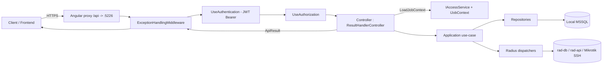

# docs/08-portal-api.md — REST API surface

> **English summary**: Seven controllers under `/api/[controller]`. JWT Bearer auth, key/issuer from `appsettings.json` (`Issuer:Code` Base64, `Issuer:Name`), token valid 1 hour (`expires_in=3600`). All controllers extend `ResultHandlerController`, which runs `LoadJobContext(target?)` to validate multi-account access and returns `ApiResult`/`ApiResult<T>`. The table below is verified against `Backend/Portal/Controllers/*.cs`.

## Authentication (احراز هویت)

- **JWT Bearer** در `AddPortalServices` (`Backend/Portal/ServiceFactory.cs:16`).
- کلید امضا از `Configuration["Issuer:Code"]` (رشته‌ی Base64) به `SymmetricSecurityKey` تبدیل و روی `IdentityHelper.Key` (static) ست می‌شود.
- Issuer/Audience از `Configuration["Issuer:Name"]`. اعتبارسنجی issuer/audience/lifetime/signing-key همگی فعال؛ `ClockSkew = Zero`.
- صدور توکن در `AuthController.Login` (`AuthController.cs:44`) → `expires_in = 3600`.
- سرویس احراز هویت توکن را در هدر `Authorization: Bearer <token>` می‌خواند (frontend).

## Base controller & result contract

- `ResultHandlerController` (`Backend/Portal/Basical/ResultHandlerController.cs:12`) کلاس پایه‌ی همه‌ی کنترلرها (به‌جز `BasicsController` که مستقیم `ControllerBase` را استفاده می‌کند).
- **`LoadJobContext(string? target)`** (`:18`): `Username` را از Identity، `Target` را از پارامتر (یا همان Username) می‌گذارد؛ اگر `target` متفاوت از کاربر باشد، `IAccessService.CheckAccess` را می‌زند و در صورت رد، `UserException(403)` پرتاب می‌کند. همیشه `JobContext.Target` را بخوانید، نه query خام.
- **`ApiResult`** (`Shared/Result/ApiResult.cs`): `Code` (short)، `Message` (نمایش به کاربر)، `Developer` (فقط dev)، `MessageMethod`، و در نسخه‌ی generic، `Data`.
- کمکی‌های static روی کنترلر پایه: `SafeApiResult` (null → 204)، `UnauthorizedApiResult` (401)، `BadRequestApiResult`.

## Exception middleware

`Backend/Portal/Basical/ExceptionHandlingMiddleware.cs`:
- نسخه‌ی Production: خطا را به `ApiResult` با کد HTTP مناسب تبدیل می‌کند؛ پیام عمومی `"خطای غیرمنتظره‌ای رخ داده است!"`.
- نسخه‌ی Development (`ExceptionHandlingMiddlewareInDevelopment`): علاوه بر موارد بالا، `Developer` را با `Message + StackTrace` پر می‌کند.
- `UserException` → کد از `HttpCode` یا `400`، پیام از `UserMessage`.
- سایر استثناها → `500`.
- انتخاب نسخه بسته به `app.Environment.IsDevelopment()` در `Program.cs`.

## Endpoint table (جدول endpointها)

> Auth: **Y** = `[Authorize]` لازم، **N** = عمومی. `target` در ستون Input یعنی query/body اختیاری `target`.

| Method | Path | Input | Controller:Method | Auth | Notes |
|---|---|---|---|---|---|
| GET | `/api/basics/prices` | — | `BasicsController.GetPrices` | N | لیست پلن‌ها/قیمت‌ها برای صفحه‌ی Home. |
| POST | `/api/auth/token` | body `TokenContext` | `AuthController.Login` | N | لاگین؛ خروجی `access_token`/`token_type`/`expires_in`. |
| POST | `/api/auth/forget-pass` | body `ResetPasswordContext` | `AuthController.ForgetPassword` | N | ارسال کد بازنشانی. |
| POST | `/api/auth/reset-pass` | body `ChangePasswordContext` | `AuthController.ResetPassword` | N | تغییر پسورد با کد. |
| POST | `/api/auth/register` | body `RegisterModel` | `AuthController.Register` | N | ثبت‌نام. |
| GET | `/api/account/get-user` | — | `AccountController.GetUser` | Y | اطلاعات کاربر جاری. |
| GET | `/api/account/full-info` | `?target` | `AccountController.GetFullInfo` | Y | اطلاعات کامل target. |
| POST | `/api/account/edit-user` | `?target` + body `EditUserModel` | `AccountController.EditUser` | Y | ویرایش اطلاعات target. |
| POST | `/api/account/change-pass` | body `ChangePasswordContext` | `AccountController.ChangePassword` | Y | تغییر پسورد لاگین (بر اساس کاربر جاری). |
| GET | `/api/account/history` | `?target` + query `HistoryContext` | `AccountController.GetHistory` | Y | تاریخچه‌ی target. |
| POST | `/api/vpn/change-ovpn` | body `ChangeOvpnContext` | `VpnController.ChangeOvpnPassword` | Y | تغییر پسورد OpenVpn؛ نیازمند تأیید پسورد اکانت. |
| GET | `/api/vpn/send-cert-email` | `?target` | `VpnController.SendCertEmail` | Y | ایمیل کانفیگ/گواهی. |
| GET | `/api/vpn/traffic-data` | `?target` | `VpnController.TrafficData` | Y | داده‌های ترافیک (نمودار). |
| GET | `/api/connection/current-con-state` | `?target` | `ConnectionController.GetCurrentConnectionState` | Y | وضعیت اتصال‌های فعال. |
| POST | `/api/connection/close-con` | body `CloseConnectionContext` | `ConnectionController.CloseConnection` | Y | بستن کانکشن (`Server` + `SessionId`). |
| GET | `/api/plan/plan-state` | `?target` | `PlanController.GetPlanState` | Y | وضعیت پلن (از `TotalPlanState`). |
| GET | `/api/plan/plan-info` | `?target` | `PlanController.GetPlanInfo` | Y | اطلاعات پلن جاری. |
| POST | `/api/plan/estimate` | body `RenewalContext` | `PlanController.Estimate` | Y | برآورد قیمت تمدید. |
| POST | `/api/plan/renewal` | body `RenewalContext` | `PlanController.Renewal` | Y | تمدید (یا صدور فاکتور اگر موجودی کم باشد). |
| POST | `/api/billing/pay` | body `int value` | `BillingController.Pay` | Y | صدور کد فاکتور برای افزایش موجودی. |
| GET | `/api/billing/get-invoice` | `?code` (int) | `BillingController.GetInvoice` | Y | دریافت فاکتور. |
| GET | `/api/billing/payment-callback` | `?code` (string) | `BillingController.PaymentCallback` | N | کال‌بک درگاه؛ pending renewals را اجرا می‌کند. |

> توجه: `BillingController` در سطح کلاس `[ApiController]`/`Route` دارد ولی `[Authorize]` فقط روی `Pay` و `GetInvoice` است؛ `PaymentCallback` عمومی است چون درگاه آن را فراخوانی می‌کند.

## Request DTOs (Context)

در `Backend/Portal/Context/` (۶ فایل) به‌علاوه‌ی `ResetPasswordContext` در `Application/Authentication/Model/`:

| DTO | Used by | Fields |
|---|---|---|
| `TokenContext` | `/auth/token` | `Username`, `Password` |
| `ResetPasswordContext` | `/auth/forget-pass` | `EmailMobile` |
| `ChangePasswordContext` | `/auth/reset-pass`, `/account/change-pass` | `Token` (کد/پسورد قدیم), `Password` |
| `ChangeOvpnContext` | `/vpn/change-ovpn` | `Target`, `Token` (پسورد اکانت), `Password` |
| `CloseConnectionContext` | `/connection/close-con` | `Target`, `Server`, `SessionId` |
| `HistoryContext` | `/account/history` | `From`, `To` |
| `RenewalContext` | `/plan/estimate`, `/plan/renewal` | `Target`, `SimultaneousUserCount`, `Days?`, `Gigabytes?` |

مدل‌های دامنه‌ای که به‌عنوان body استفاده می‌شوند:
- `RegisterModel` (`Domain/Account/Model/RegisterModel.cs`) — `extends EditUserModel`.
- `EditUserModel` (`Domain/Account/Model/FullUserModel.cs`) — `Firstname`, `Lastname`, `Email`, `Mobile` و …

## Differences vs `Architecture/analyse.md`

مستند قدیمی `analyse.md` (نوشته‌شده قبل از پیاده‌سازی نهایی) با پیاده‌سازی فعلی این تفاوت‌ها را دارد:

| Topic | `analyse.md` | Current implementation |
|---|---|---|
| `/auth/logout` | GET موجود بود | حذف شده؛ فرانت با پاک کردن توکن لاگ‌اوت می‌کند (مسیر `logout` به `LoginComponent` می‌رود). |
| `/auth/forget-pass` request | `{ emailMobile }` | body `ResetPasswordContext` با فیلد `EmailMobile` (یکسان). |
| `/connection/close-con` | بدون فیلد سرور | اکنون `Server` + `SessionId` (`CloseConnectionContext`). |
| `/billing/*` | در analyse نبود | اضافه شده: `pay`, `get-invoice`, `payment-callback`. |
| `/plan/renewal` request | شامل `type`/`value` | اکنون `Days`/`Gigabytes`/`SimultaneousUserCount` (`RenewalContext`). |

## Request topology

