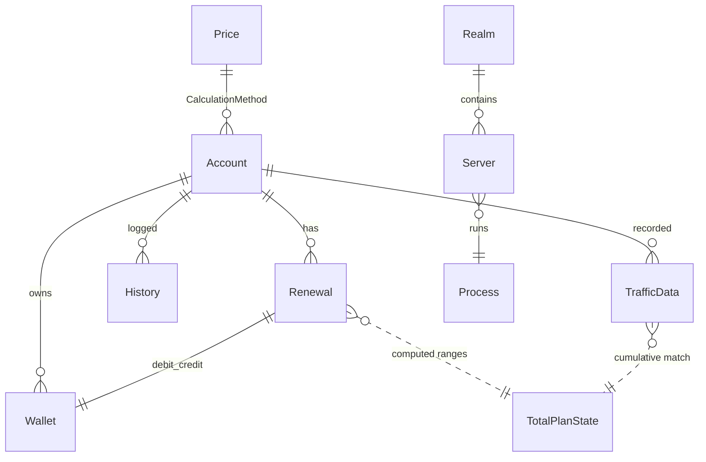

# docs/09-database.md — Database

> **English summary**: Two databases. Local MSSQL (`FastBypass`, scenario `FastBypass_DbScenario`) holds accounts, wallet, history, renewals, traffic, servers, realms, prices — its heart is the `TotalPlanState` view that computes current plan state from cumulative traffic windows. The Radius MySQL DB (RadiusDesk) is read via `RadDbContext`. Schema scripts live in `Database/LocalDatabase/`; test seed data in `Backend/Tests/Data/`. Sensitive values are referenced by config key only.

## Local DB (دیتابیس محلی MSSQL)

- دیتابیس: `FastBypass` (تولید) و `FastBypass_DbScenario` (سناریو/تست). connection string در `LocalDatabaseOptions:ConnectionString` (`Backend/Portal/appsettings.json`) — **مقدار در مستندات تکرار نمی‌شود**.
- اسکریپت‌ها در `Database/LocalDatabase/`؛ اجرا به‌ترتیب: ابتدا `Database.sql` سپس بقیه‌ی `.sql`.

### Tables (جداول)

| File | Table | Key / Unique | Notes |
|---|---|---|---|
| `Database.sql` | (db creation) | — | ساخت دیتابیس `FastBypass`. |
| `Account.sql` | `Account` | `PK Id`, `UK_Account_Username`, `UK_Account_Email` (filtered `WHERE Email IS NOT NULL`), `UK_Account_Mobile` (filtered), `FK_Owner→Account`, `FK_CalculationMethod→Price` | اکانت + زیرمجموعه (`Owner`) + `VpnPassword` جدا. |
| `Wallet.sql` | `Wallet` | `PK Id` | کیف پول + `InvoiceCode`. |
| `History.sql` | `History` | `PK Id` | لاگ رویداد روی `Target`. |
| `ResetPassword.sql` | `ResetPassword` | — | توکن بازنشانی. |
| `Renewal.sql` | `Renewal` | `PK Id`, `FK AccountId→Account`, `WalletDebit/WalletCredit` | یک تمدید. |
| `PlanState.sql` | `PlanState` | — | **view** mapping (نه جدول پر-شده؛ از `TotalPlanState` خوانده می‌شود). |
| `TrafficData.sql` | `TrafficData` | `PK Id` | رکورد ترافیک دوره‌ای. |
| `Server.sql` | `Server` | `PK Id`, `FK RealmId→Realm` | سرور با `Features` (Flags) و `OsType`. |
| `Realm.sql` | `Realm` | `PK Id` | گروه سرور + `BandWidth`. |
| `Price.sql` | `Price` | `PK Id` | `CalculatorCode` (کد C#). |
| `TotalPlanState.sql` | `TotalPlanState` (VIEW) | — | محاسباتی — پایه‌ی `PlanStateEntity`. |

> ایندکس‌های یکتای فیلترشده: `UK_Account_Email` و `UK_Account_Mobile` فقط روی ردیف‌های NOT NULL اعمال می‌شوند تا چند کاربر با ایمیل/موبایل خالی مجاز باشند (`Account.sql:28-35`).

### Security note: default admin seed

`Account.sql:24` یک ادمین پیش‌فرض با یوزرنیم `admin` و یک هش پسورد ثابت seed می‌کند. این یک **TODO امنیتی** است: در محیط تولید باید این پسورد پیش‌فرض عوض شود یا ردیف حذف/غیرفعال گردد. مقدار هش در مستندات تکرار نمی‌شود.

## `TotalPlanState` view (نمایش کلیدی)

`Database/LocalDatabase/TotalPlanState.sql` مهم‌ترین artifact SQL است. خروجی آن ردیف «وضعیت فعلی پلن» برای هر اکانت است که `PlanStateRepository` می‌خواند و `PlanStateEntity` را پر می‌کند.

### منطق خط‌به‌خط

```mermaid
flowchart TB
    A[Renewal rows per account] -->|ROW_NUMBER ordered by Id| R1[RowNumber per renewal]
    R1 -->|SUM TrafficLimit UNBOUNDED PRECEDING..1 PRECEDING| R2[TrafficLimitRangeStart]
    R2 -->|RangeEnd = TrafficLimit + RangeStart| R3[Ranges per renewal]
    T[TrafficData rows per account] -->|SUM DataIn+DataOut preceding| TD[CumulativeTrafficUsed]
    TD -->|MAX StartSession| TD2[LastConnectTime]
    R3 -->|join: RangeStart <= Cum < RangeEnd| JOIN[match each traffic row to its renewal band]
    JOIN -->|ROW_NUMBER order by TotalTrafficUsed DESC| TOP[TopTrafficData per (account,renewal)]
    TOP -->|WHERE TopTrafficData = 1| OUT[one row = current plan]
    A -->|DATEADD DAY, TimeLimitInDays, Created| EXP[ExpirationDate]
    JOIN -->|TrafficLeft = RangeEnd - TotalTrafficUsed| OUT2[TrafficLeft]
```

توضیح مفهومی:

1. **شماره‌گذاری تمدیدها**: برای هر اکانت، تمدیدها به ترتیب `Id` شماره‌گذاری می‌شوند (`RowNumber`).
2. **دامنه‌ی ترافیک هر تمدید**: مجموع ترافیک تمدیدهای قبلی (`TrafficLimitRangeStart` از `SUM() OVER(... ROWS BETWEEN UNBOUNDED PRECEDING AND 1 PRECEDING)`) تا `RangeStart + TrafficLimit` (`RangeEnd`). یعنی هر تمدید یک «بان» از ترافیک تجمعی به خود اختصاص می‌دهد.
3. **ترافیک تجمعی**: روی `TrafficData`، `DataIn + DataOut` به‌صورت تجمعی محاسبه می‌شود (`CumulativeTrafficUsed`) و `LastConnectTime` با `MAX(StartSession)`.
4. **تطبیق**: هر ردیف ترافیک به تمدیدی وصل می‌شود که `CumulativeTrafficUsed` در بازه‌ی `[RangeStart, RangeEnd)` آن قرار دارد.
5. **انتخاب ردیف برتر**: برای هر `(account, renewal)`، ردیف ترافیک با بیشترین `TotalTrafficUsed` برچسب `TopTrafficData=1` می‌گیرد.
6. **فیلتر نهایی**: `WHERE ISNULL(pl.TopTrafficData, 1) = 1` — یعنی یا ردیف برتر است یا اصلاً تطبیقی وجود ندارد (اکانت بدون ترافیک).
7. **باقیمانده‌ها**: `ExpirationDate = DATEADD(DAY, TimeLimitInDays, Created)` و `TrafficLeft = RangeEnd - TotalTrafficUsed`.

## Radius DB (دیتابیس ردیوس MySQL)

- دسترسی از طریق `RadDbContext` (`Backend/FreeRadius/Repository/DbContext/`) با options `RadDapperOptions`.
- جداول RadiusDesk که استفاده می‌شوند (نام‌ها در repoها): `RadAcct` (حسابداری اتصال)، `permanent_users`، `nas`، `UserPlanState`، `TopUp`، `Profile`، `Realm` (مستقل از realm محلی)، `Cloud`.
- **قاعده‌ی دسترسی** (`analyse.md:308`): **read مستقیم از rad-db**، **write از طریق rad-api** (Web API `cake4/rd_cake` در `RadiusDeskService`) تا بار روی FreeRADIUS کمتر شود.



## Test data (داده‌های تست)

در `Backend/Tests/Data/`:

- `Local/`, `Radius/`, `Sql/`, `Mikrotik/` — فایل‌های `.json`/`.sql` داده‌های seed سناریوی تست.
- `config.ovpn` — نمونه‌ی فایل کانفیگ OpenVpn برای تست‌های گواهی.
- تست‌ها با `ServiceInitializer` (`Backend/Tests/Initializer/ServiceInitializer.cs`) یک host کامل (`AddAppServices` + `AddPortalServices` + `AddAdminServices`) می‌سازند و mockها را با reflection رجیستر می‌کنند.
