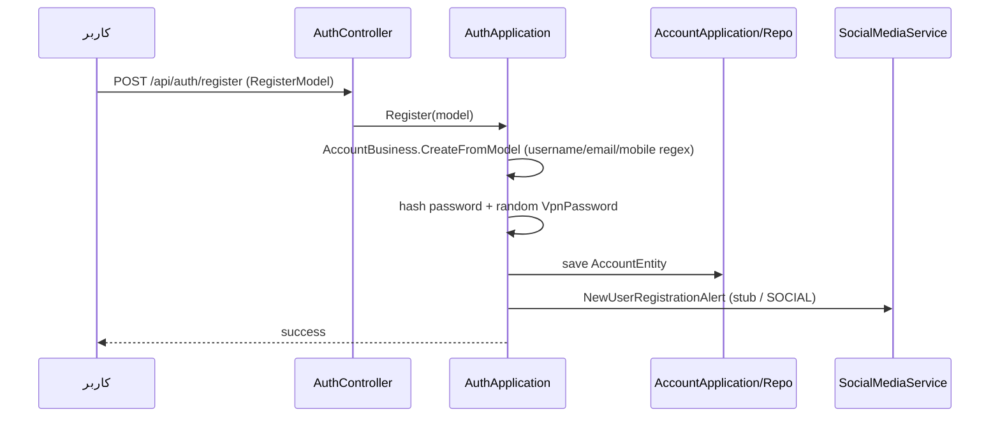
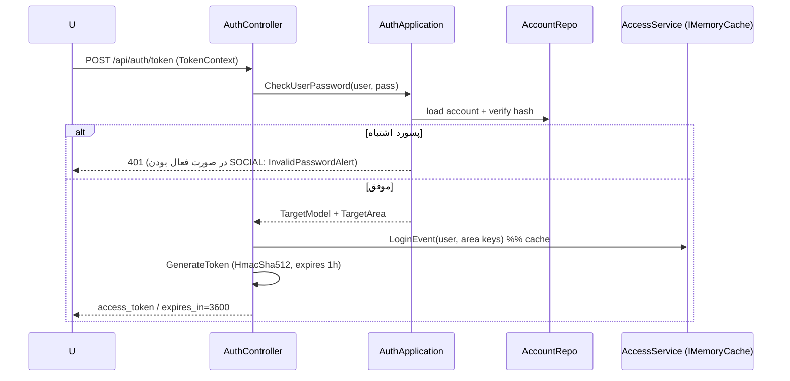
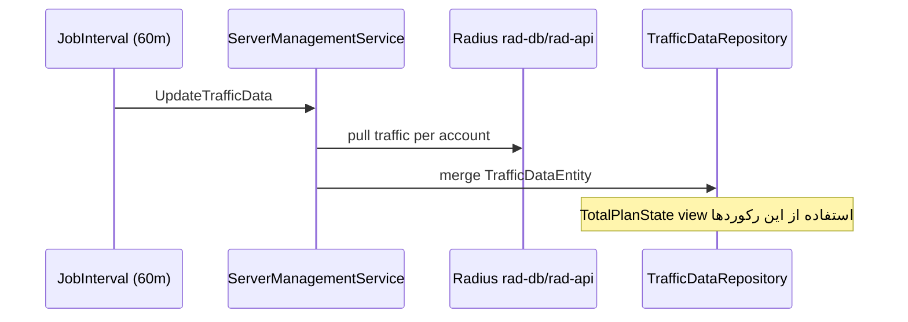
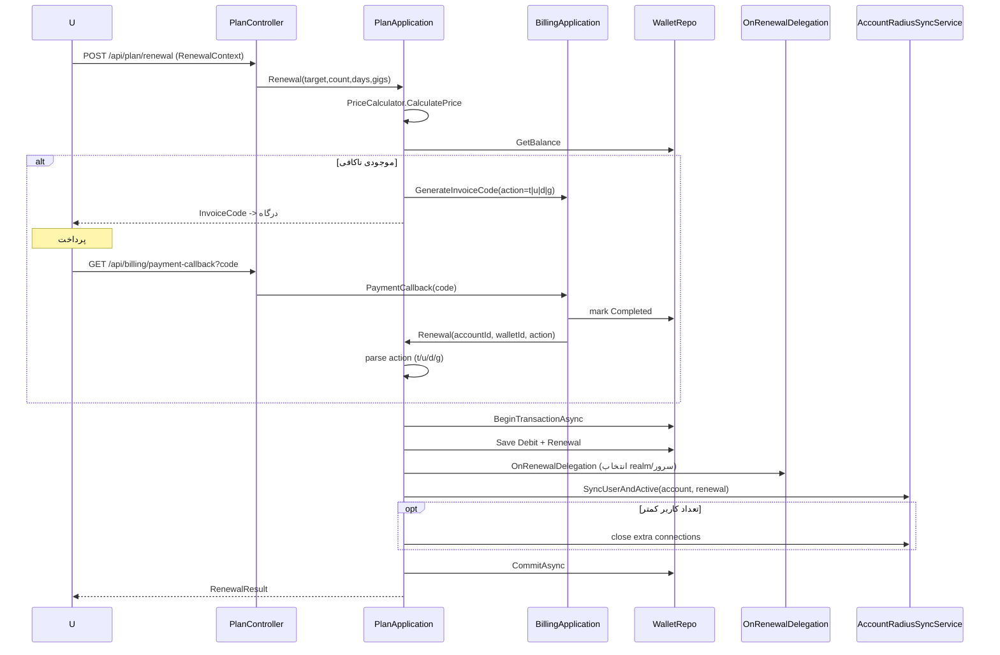
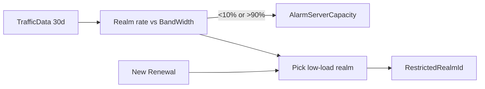
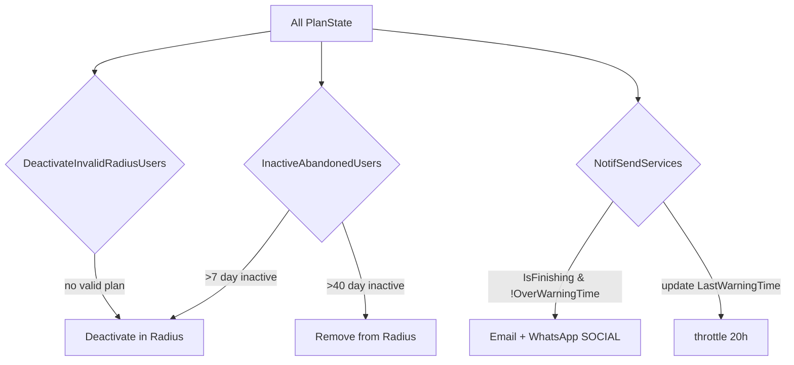
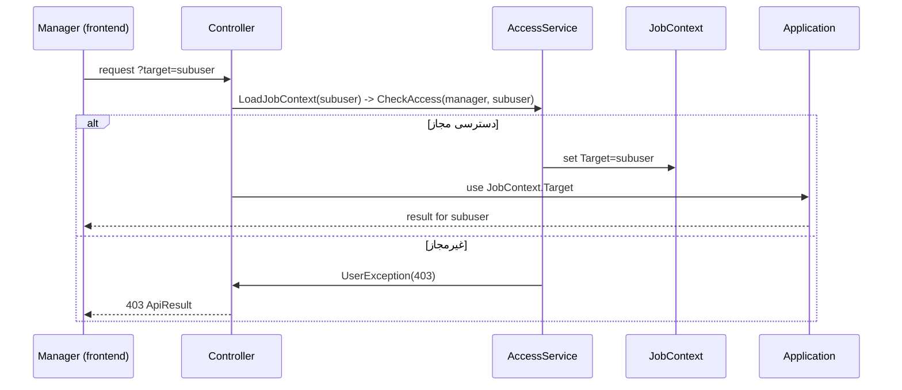

# docs/11-business-flows.md — End-to-end scenarios

> **English summary**: Step-by-step walkthroughs of the common user journeys and the periodic background behaviors: Register, Login, Dashboard/traffic, Renewal (with invoice), traffic sync, capacity management, deactivation cascade, and multi-account delegation. Each has a short Mermaid sequence diagram and the key code anchors.

## 1. Register (ثبت‌نام)

`AuthApplication.Register` → اعتبارسنجی (regex در `AccountBusiness`) → ساخت `AccountEntity` (`CreateFromModel`) → هش پسورد لاگین + `VpnPassword` تصادفی → ذخیره در local DB → هشدار اجتماعی (WhatsApp `#if SOCIAL`).

> در طراحی اولیه قرار بود کاربر هم‌زمان در ردیوس ثبت شود (`analyse.md:325`)؛ وضعیت فعلی را در کد بررسی کنید (`docs/12`).

## 2. Login (ورود)

`AuthController.Login` → `AuthApplication.CheckUserPassword` (local DB) → ساخت `TargetArea` (مدیر همه‌ی زیرمجموعه‌ها را می‌بیند) → صدور JWT → `AccessService.LoginEvent` (set cache `TargetArea|{username}`).

## 3. Dashboard / traffic (داشبورد و مصرف)

- `UpdateTrafficData` (در `JobInterval`) به‌صورت دوره‌ای ترافیک را از radius pull می‌کند و در `TrafficData` ذخیره می‌کند.
- صفحه‌ی داشبورد `GET /api/plan/plan-state` را می‌زند که از view `TotalPlanState` وضعیت جاری را می‌خواند (`docs/09`).
- نمودار ۳۰ روزه از `GET /api/vpn/traffic-data` سرو می‌شود.

## 4. Renewal (تمدید — با فاکتور)

جریان کلیدی `PlanApplication.Renewal`:

1. برآورد قیمت با `PriceCalculator` (Roslyn، کد در DB).
2. بررسی موجودی با `WalletBusiness.CheckMoneyNeed`.
3. **اگر موجودی کافی است**: تراکنش local + `SyncUserAndActive` روی radius + commit (در صورت خطا، `DeactivateUsers` + rollback).
4. **اگر موجودی ناکافی است**: صدور فاکتور با `BillingApplication.GenerateInvoiceCode` و `Action = "{target}t|{count}u|{days}d|{gigabytes}g"`؛ کاربر به درگاه می‌رود.
5. در کال‌بک (`PaymentCallback`)، فاکتور completed می‌شود و `PlanApp.Renewal(accountId, walletId, action)` دوباره اجرا می‌شود؛ این بار موجودی کافی است و تمدید انجام می‌شود.
6. اگر تعداد کاربر کاهش یافته باشد، کانکشن‌های اضافه بسته می‌شوند.

## 5. Traffic sync (همگام‌سازی دوره‌ای ترافیک)

در `JobInterval` (هر ۶۰ دقیقه) به‌عنوان اولین کار سریال: `ServerManagementService.UpdateTrafficData` از radius pull می‌کند، `TrafficDataEntity` را merge می‌کند و `Realm.LastTrafficSync` را به‌روزرسانی می‌کند.

## 6. Capacity management (مدیریت ظرفیت)

`ServerManagementService.CheckUserServerBalance`:
- نرخ مصرف realm را از ترافیک ۳۰ روز گذشته نسبت به `BandWidth` محاسبه می‌کند.
- اگر <۱۰٪ یا >۹۰٪ باشد هشدار ادمین (`SocialMediaService.AlarmServerCapacity`).
- هنگام تمدید جدید، realm کم‌بار برای `RestrictedRealmId` انتخاب می‌شود (`PlanRepo.GetTopRestrictedRealmId`).

## 7. Deactivation cascade (آبشار غیرفعال‌سازی)

در `JobInterval` (موازی با Task.WaitAll):
- **`InactiveAbandonedUsers`** (`AccountMonitoringService`): اکانت‌های رهاشده پس از `MaxDaysDeactivatePlanToDisable=7` روز غیرفعال می‌شوند و پس از `MaxDaysDeactivatePlanToDelete=40` روز از radius حذف می‌شوند.
- **`DeactivateInvalidRadiusUsers`** (`AccountRadiusSyncService`): کاربرانی که پلن معتبر ندارند در radius غیرفعال می‌شوند (`DeactivateUserExcept` realm).
- **`NotifSendServices`** (`AccountMonitoringService`): هشدار پایان پلن به‌صورت ایمیل/واتساپ با throttle `DelayBetweenWarnings=20h`.

## 8. Multi-account delegation (تکلیف زیرمجموعه)

کاربر مدیر با `target` زیرمجموعه‌ی خود عمل می‌کند:

> نکته: اکانت با `Id==1` (admin) در سطح دسترسی به همه‌ی کاربران دسترسی دارد (تعریف `TargetArea` در لاگین).
